# Climbing App Database

A Python + MySQL app for tracking climbing locations, routes, comments, ascents, and wishlists. Users can browse areas, add new climbs, log ascents with ratings, and manage personal wishlists.

## Setup Instructions

### 1) Install Dependencies
```bash
pip install -r docs/requirements.txt
```
- Make sure you have docker server or docker desktop installed on your machine

### 2) Create the Database
#### Using docker:
```bash
#create the container with name climbing-app-container and password 1234
docker run --name climbing_app_container -e MYSQL_ROOT_PASSWORD='1234' -p 3306:3306 -d mysql:latest
#populate database with sample data
docker exec -it climbing_app_container -uroot -p1234 < mysql/schema.sql
docker exec -it climbing_app_container -uroot -p1234 < mysql/data.sql

```


### 3) Run the App
```bash
python3 python_app/main.py
```
---

## Features

- User login and creation
- Browse locations and climbs
- Search for locations or climbs
- Add new locations and climbs
- View climb details, comments, and ascents
- Add comments, log ascents, and rate climbs
- Manage wishlist and ascents (view/search/delete)

---

## Example Usage (with Screenshots)
**Logging In**

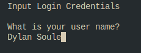

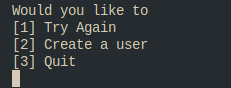

**Main Menu**

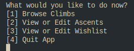

**Browse locations and climbs**

- 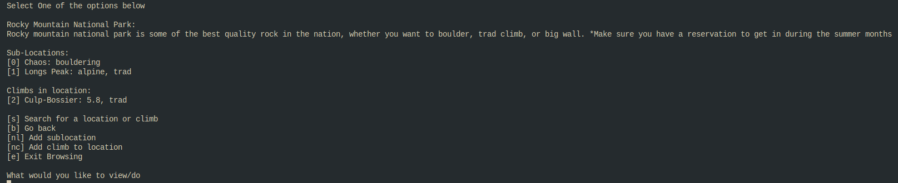

- 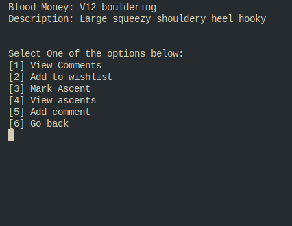

- 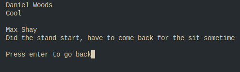

**View a climb and add an ascent**

- 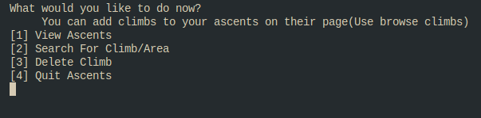

- 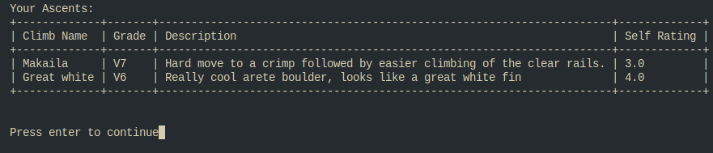

- 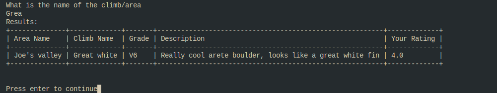

**Wishlist and ascents management**

- 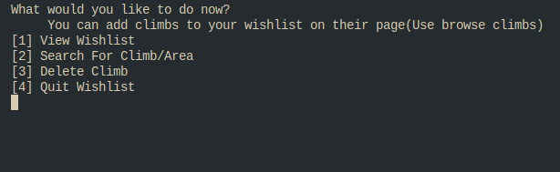

- 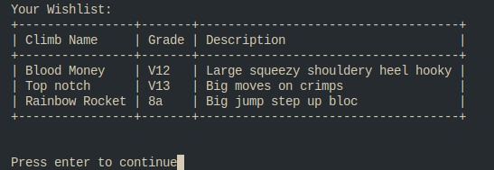


---

## Database Structure
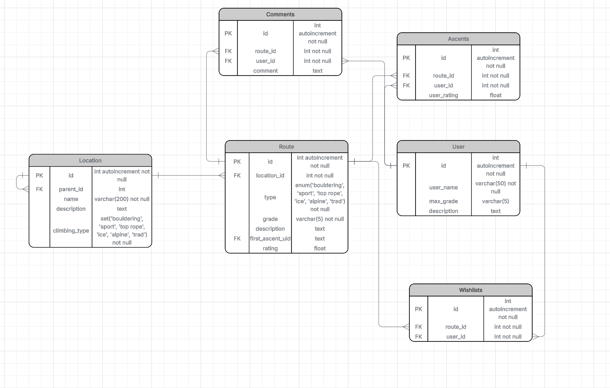

### Table info:
- Locations - Information about where the climbing area is and descriptions of the type of climbing and how to get there.
  - Hierarchical table to allow for nested locations(Country, state, location, sublocation, etc.) 
- Climbs - Information about the climbs including the grade, date it was put up, who put it up by, etc. 
- Users - individual user profiles including their physical statistics, top grade, and what they aspire to do(Similar to a social media profile with a short biography).
- Ascents - what each user has marked as something they have completed.
- Comments - Comments attached to each climb, in its own table so more comments can be added.
- Wishlists - Keeps track of wishlists that people have made

**There is also an app user created that only has limited access when populating database**

---


## Reflection

This project reinforced how important a well-structured relational schema is for building a usable application. The relationships between locations, routes, and user actions required careful foreign key design to keep data consistent.

It also highlighted practical challenges with CLI UX and input validation. Ensuring clean user input, avoiding crashes, and providing clear feedback took more time than expected, but improved the overall reliability of the app.

Finally, working end-to-end (schema → data seeding → app logic) showed how small inconsistencies can ripple through the system. Iterating on queries and joins helped build a better understanding of SQL and how application logic depends on it.